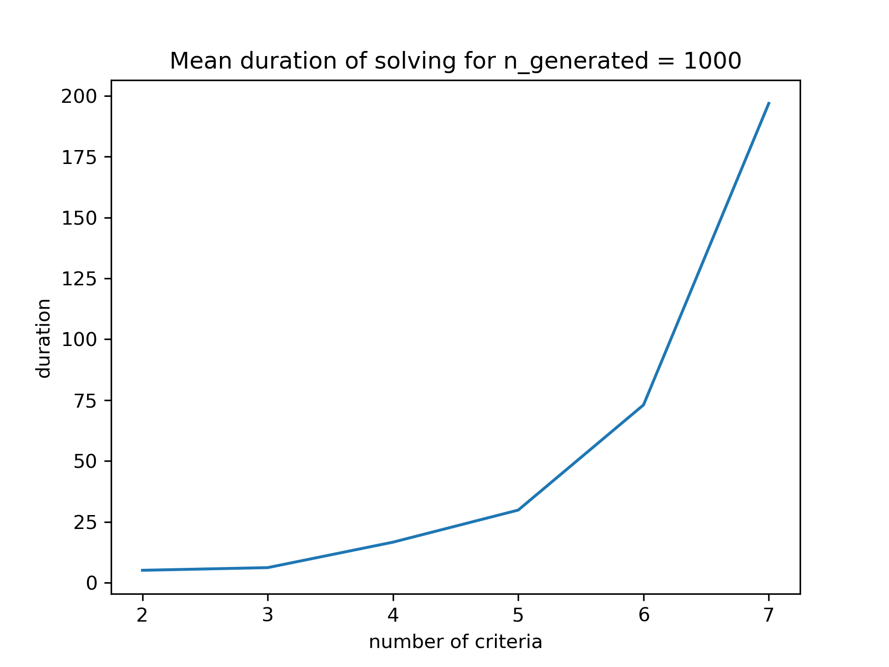

# This is a project for decision systems

Please feel free to read the file `MR-Sort-NCS.pdf` to understand the case.

# Inv-MR-Sort
MR-Sort is a decision system that sorts the items into classes based on their evaluation on each criteria using some parameters. The goal of Inverse MR-Sort is to learn those parameters from decisions that have been made. 
Please refere to the [paper](https://www.researchgate.net/publication/221367488_Learning_the_Parameters_of_a_Multiple_Criteria_Sorting_Method) for more details.
## File structure:
```
    Inv-MR-Sort
        ├── main.py                  # data generation and model testing
        ├── main.sh                  # executes `main.py` and saves its log
        ├── eval.py                  # evaluate the model performance
        ├── mip.py                   # Gurobi solver
        ├── data_generator.py        # generates data to output/data.csv
        ├── instance_generator.py    # generates instances with MR-sort
        ├── utils.py                 # helper functions
        └── config.py                # configuration file 
```
## Classes:
The Classes are given as integers from `1` to `MaxClasses`, where `MaxClasses` is the maximum number of classes in the data. `0` is reserved for instances that can't be in any Class.

## Data Structure :
Each instance of the problems should be stroed in a csv file with the following format:
<center>

| id  |  mark_1  |  mark_2  |mark_3 |   mark_4  |      class   |
|---- |----|----|----|--------------|-----------|
|  0  |  12  |  16  |    12         |     15    |     1     |
|  1  |  12  |  2  |     10         |     8     |     0    |
|  2  |  12  |  10  |    13         |     14    |     1    |
</center>

## Usage:
- Please refere to `config.py` to change the configuration that we have used.
- To generate data, go inside the folder, and run data_generator.py. It is possible to change `default_params` in `config.py` to generate different data, or `data_saving_path` to save the data to a different file.
```bash
cd Inv-MR-Sort
python data_generator.py
```
- To Use the model with a generated dataset with the default parameters and test its performance, use the following command, and all the outputs will be saved to `Inv-MR-Sort/output/`.
```bash
cd Inv-MR-Sort
python main.py
```
```python
default_params = {
    "n": 6,  # Number of criterias
    "p": 1,  # number of profiles (the classe "no classe" is not counted)
    "profiles": [[10, 12, 10, 12, 8, 13]],  # b^h_j , h=1..p , j=1..n
    "weights": [0.15, 0.25, 0.1, 0.15, 0.1, 0.25],  # w_j , j=1..n
    "lmbda": 0.7,
    "n_generated": 1000,
}
```

- To Use the model with a specific dataset, use the following command, and the output will be saved to `Inv-MR-Sort/output/output.csv` and also printed at the end of the program.
```bash
cd Inv-MR-Sort
python main.py -d data_path
```
## Output :
Lets look at the performance of the Gurobi solver. In figures below, we show the prediction performance (accuracy, precision, recall, F1-score) of the model on the test dataset. And we also show the duration of Inference.


The effect of variating `n_generated` the number of instances to be trained on is shown in the following figure.
Performance|Duration(in s)
:---:|:---:
 | 


The effect of variating `n` the number of criterias is shown in the following figure.
Performance|Duration(in s)
:---:|:---:
 | 