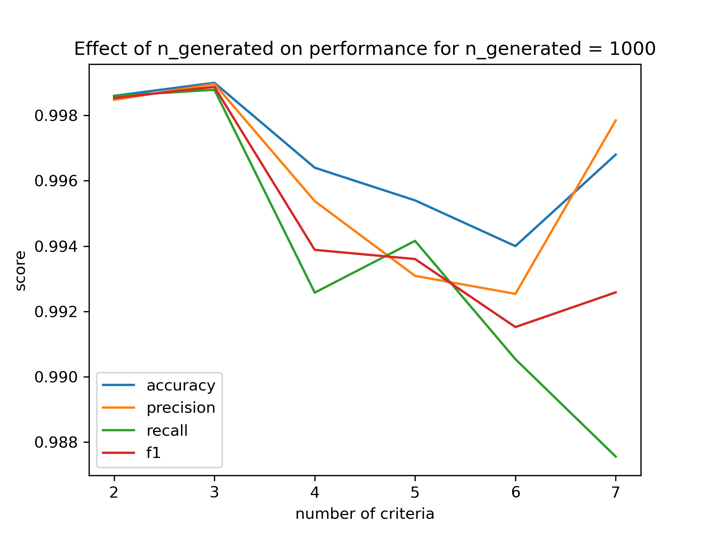

# This is a project for decision systems

Please feel free to read the file `MR-Sort-NCS.pdf` to understand the case. Inside the python files, you can also find references to some papers used.

# Inv-MR-Sort
MR-Sort is a decision system that sorts the items into classes based on their evaluation on each criteria using some parameters. The goal of Inverse MR-Sort is to learn those parameters from decisions that have been made. 
Please refere to the [paper](https://www.researchgate.net/publication/221367488_Learning_the_Parameters_of_a_Multiple_Criteria_Sorting_Method) for more details.
## File structure:
```
    Inv-MR-Sort
        ├── main.py                  # data generation and model testing
        ├── main.sh                  # executes `main.py` and saves its log
        ├── eval.py                  # evaluate the model performance
        ├── mip.py                   # Gurobi solver
        ├── data_generator.py        # generates data to output/data.csv
        ├── instance_generator.py    # generates instances with MR-sort
        ├── utils.py                 # helper functions
        └── config.py                # configuration file 
```
## Classes:
The Classes are given as integers from `1` to `MaxClasses`, where `MaxClasses` is the maximum number of classes in the data. `0` is reserved for instances that can't be in any Class.

## Data Structure :
Each instance of the problems should be stroed in a csv file with the following format:
<center>

| id  |  mark_1  |  mark_2  |mark_3 |   mark_4  |      class   |
|---- |----|----|----|--------------|-----------|
|  0  |  12  |  16  |    12         |     15    |     2    |
|  1  |  12  |  2  |     10         |     8     |     0    |
|  2  |  12  |  10  |    13         |     14    |     1    |
</center>

## Usage:
- Please refer to `config.py` to change the configuration that we have used.
- To generate data, go inside the folder, and run data_generator.py. It is possible to change `default_params` in `config.py` to generate different data, or `data_saving_path` to save the data to a different file.
```bash
cd Inv-MR-Sort
python data_generator.py
```
- To Use the model with a generated dataset with the default parameters and test its performance, use the following command, and all the outputs will be saved to `Inv-MR-Sort/output/`.
```bash
cd Inv-MR-Sort
python main.py
```
```python
default_params = {
    "n": 6,  # Number of criteria
    "p": 1,  # number of profiles (the classe "no classe" is not counted)
    "profiles": [[10, 12, 10, 12, 8, 13]],  # b^h_j , h=1..p , j=1..n
    "weights": [0.15, 0.25, 0.1, 0.15, 0.1, 0.25],  # w_j , j=1..n
    "lmbda": 0.7,
    "n_generated": 1000,
}
```
- It is possible to ignore the `Analysis code` (heavy) by adding `-l` to activate the light mode.
```bash
python main.py -l
```

- To use a different dataset architecture (e.g. different number of classes), please change the `default_params` in `config.py` or change the code of `main.py`. Otherwise, you can provide the 3 arguments `-n` number of criteria, `-p` number of profiles and `-g` number of generated instances.

```bash
python main.py -n 4 -p 2 -g 1000 -l
```

- To Use the model with a specific dataset, use the following command, and the solution will be saved to `Inv-MR-Sort/output/solution.sol` and also printed at the end of the program.
```bash
python main.py -d data_path
```
- To use the model with a noisy Decision Maker, use the following command to generate a noisy dataset and to test its generalization performance. It possible to provide the 4 arguments `-N` to specify decision error probability `-n` number of criteria, `-p` number of profiles and `-g` number of generated instances. The noisy mode enables light mode automatically.
```bash
python main.py -N 0.05 -g 1000 -n 4 -p 2
```
## Output :
Let's look at the performance of the Gurobi solver. In figures below, we show the prediction performance (accuracy, precision, recall, F1-score) of the model on the test dataset. And we also show the duration of Inference.


The effect of variating `n_generated` the number of instances to be trained on is shown in the following figure.
Performance|Duration(in s)
:---:|:---:
 | 


The effect of variating `n` the number of criteria is shown in the following figure.
Performance|Duration(in s)
:---:|:---:
 | 


# Inv-NCS
Non-compensentary sorting relies on the notions of satisfactory values of the criteria and sufficient coalitions of criteria. it combines into defining the fitness of an alternative: an alternative is deemed fit if it has satisfactory values on a sufficient coalition of criteria.
## File structure:
```
    Inv-NCS
        │   config.py                       # input parameters to generate data
        │   data_generator.py               # generates data to output/data.csv
        │   learn.py                        # model testing
        │   main.py                         # data generation and model testing
        │   sat.py                          # SATSolver class
        │
        ├───gophersat                       # SAT solver files
        │   ├───linux64
        │   │       gophersat-1.1.6
        │   ├───macos64
        │   │       gophersat-1.1.6
        │   └───win64
        │           gophersat-1.1.6.exe
        │
        └───output
                data.csv                    # Generated data
                solution.sol                # final solution with boolean values of each clause
                workingfile.cnf             # the cnf file containing clauses

```

## Classes:
The Classes are given as integers from `0` to `len(profiles)`, where `len(profiles)` is the maximum number of classes in the data. 

## Data Structure :
Data have the same structure as in Inv-MR-sort:
<center>

| instance id  |criterion_0|criterion_1|criterion_2|criterion_3|    class  |
|------------- |-----------|-----------|-----------|-----------|-----------|
|  0           |  12       |  16       |    12     |     15    |     1     |
|  1           |  12       |  2        |    10     |     8     |     0     |
|  2           |  12       |  10       |    13     |     14    |     1     |

</center>

After running the code (see next section), you could see the generated data in `Inv-NCS/output/data.csv`
## Usage:

- Add the `gophersat` solver folder in the Inv-NCS folder, just like the structure shown above.
- Please refer to `config.py` to change the configuration that we have used.
- It is possible to run the whole code of NCS resolution (data generation + solver) by running the main.py file, the solution will be printed in the terminal and saved in `Inv-NCS/output/solution.sol`
```bash
python Inv-NCS/main.py
```
## Output :
After running the main.py file, you could see the set of suffiscient coalitions learned, otherwise the solution of the SAT problem could be seen in `Inv-NCS/output/solution.sol`
with the boolean value of each clause in this format:
Clauses: [-1, 2, -3, -4, ...  -415, 416] 
while each of the variables of the problem is enumerated in its positive index if it has to be true to satisfy the SAT problem, or its negative index if it has to be negative to satisfy the SAT problem.